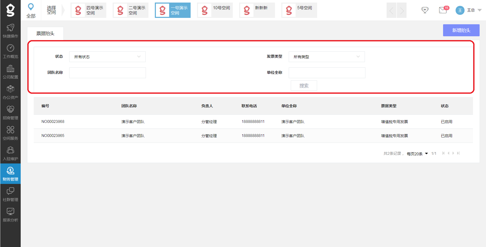

# 发票抬头管理

## 说明

`发票抬头管理`用于维护和管理客户的发票抬头。

抬头分两种：`增值税专用发票`和`增值税普通发票` 

一个有效的抬头会经过`录入`和`认证`两步。 录入的来源可以是入驻客户从客户端直接提交，或者把权限开放给相关的运营运营人员，推荐`社区经理`。

根据自身业务规定，运营商可要求申请时提供相关证明。 然后由`社区经理`或者`出纳`进行审核。 

## 检索发票抬头


 用户可根据状态、发票类型、团队名称的不同进行费用的筛选。如图：

## 新增发票抬头


点击右上角`新增抬头`，用公司名称搜索到要添加发票抬头的公司，根据负责人姓名、联系电话、邮箱核对无误。

填写抬头信息，增值税普通发票：

* 选择抬头类型
* 单位名称
* 税号

增值税专用发票：

* 选择抬头类型
* 单位名称
* 税号
* 公司地址
* 电话
* 开户银行
* 开户银行账号

需要的话可上传凭证

